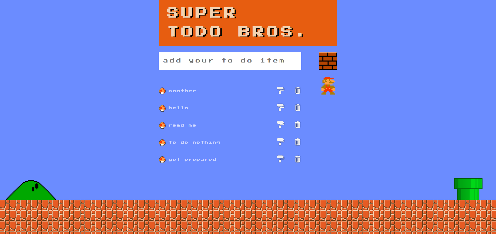

# Todo list

## stack

> - pug
> - CSS
> - JS
> - express

## additional

> - ESLint with Airbnb base
> - nodemon

# a screenshot from the page

---

\*FYI I have used a simple counter function that generates id based on the last id number (number+= 1). If you will use nodemon (as nodemon restarts the server) it will always return the same id for all of the new todo items.
